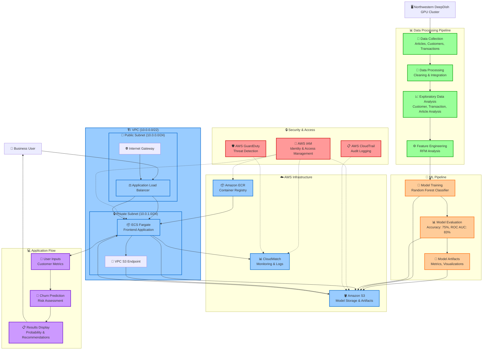

# H&M Churn Prediction Project Flowchart

## Enhanced Project Components

### 1. **Security & Compliance Layer**
   - **AWS IAM**: Role-based access control for all AWS resources
   - **CloudTrail**: Audit logging for all API calls and resource access
   - **GuardDuty**: Threat detection and security monitoring
   - **VPC Security Groups**: Network-level security controls

### 2. **Network Architecture**
   - **VPC (10.0.0.0/22)**: Isolated network environment
   - **Public Subnet**: Houses load balancer with internet access
   - **Private Subnet**: Secure environment for application containers
   - **VPC S3 Endpoint**: Private connection to S3 without internet routing

### 3. **Data Processing Pipeline**
   - **Northwestern DeepDish**: External GPU cluster for initial processing
   - **Data Collection**: Multi-source data ingestion (CSV files)
   - **ETL Processing**: Data cleaning and integration
   - **Feature Engineering**: RFM (Recency, Frequency, Monetary) analysis

### 4. **ML/AI Pipeline**
   - **Model Training**: Random Forest classifier with hyperparameter tuning
   - **Model Evaluation**: Comprehensive metrics and validation
   - **Artifact Management**: Automated storage of models and metadata

### 5. **Production Infrastructure**
   - **Container Orchestration**: ECS Fargate for serverless containers
   - **Load Balancing**: ALB for high availability and traffic distribution
   - **Storage**: S3 for scalable object storage with lifecycle policies
   - **Monitoring**: CloudWatch for operational insights

### 6. **Application Layer**
   - **Streamlit Interface**: Interactive web application
   - **Real-time Inference**: On-demand churn prediction
   - **User Experience**: Intuitive risk assessment and recommendations

## Project Components

1. **Data Pipeline**
   - Load data from CSV files
   - Process and prepare data for modeling
   - Generate EDA visualizations
   - Create feature-engineered dataset

2. **Model Training**
   - Train Random Forest classifier
   - Generate model metrics and visualizations
   - Save model artifacts to local storage
   - Upload artifacts to S3

3. **Web Application**
   - Streamlit interface for user inputs
   - Fetch latest model from S3
   - Generate predictions based on user inputs
   - Display churn probability and risk assessment

4. **AWS Deployment**
   - Store artifacts in S3
   - Package application in Docker container
   - Deploy container via ECS Fargate
   - Expose application through Application Load Balancer
   - Monitor via CloudWatch 